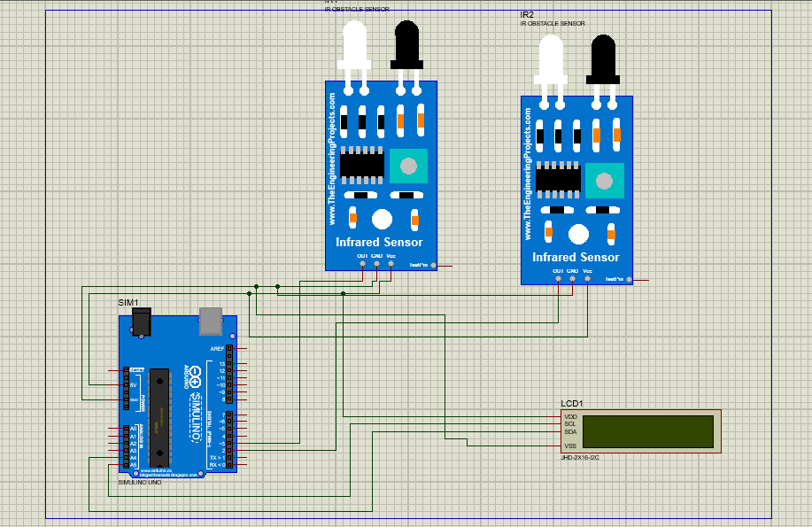

# 🚦 Bi-Directional Counter with Speed Measurement

This Arduino-based project uses two IR sensors to detect direction of movement and measure the speed of an object. The count and speed are displayed on an I2C LCD.

---

## 📌 Features

- Detects direction: IN or OUT
- Calculates and displays speed (in m/s)
- LCD I2C display output
- Real-time counter for both directions

---

## 🧰 Components Used

- Arduino Uno
- IR Sensor Module × 2
- I2C 16x2 LCD Display (Address: 0x27)
- Jumper wires
- Breadboard or mounting base

---

## ⚙️ Working Principle

- When **Sensor 1** triggers before **Sensor 2**, the object is **entering**.
- When **Sensor 2** triggers before **Sensor 1**, the object is **exiting**.
- The time difference between the triggers is used to calculate speed:
  
  \[
  \text{Speed} = \frac{\text{Distance between sensors}}{\text{Time taken}}
  \]

---

## 🚀 How to Upload

1. Open the file `bi_directional_counter.ino` in Arduino IDE.
2. Connect your Arduino Uno to PC.
3. Install libraries: `LiquidCrystal_I2C` (via Library Manager).
4. Upload the sketch to your board.
5. Open Serial Monitor and observe the LCD output.

---

## 📸 Circuit Diagram

---

## 🧪 Demo 

🎥 [Watch the Demo Video on YouTube](https://youtu.be/IhTZK_EVxWw)

---

